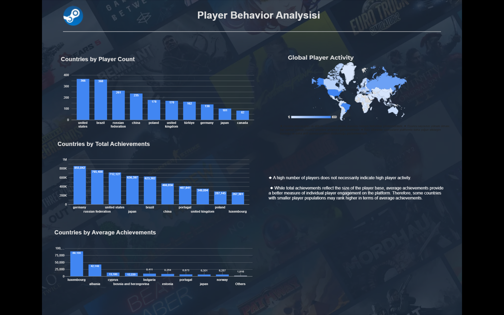
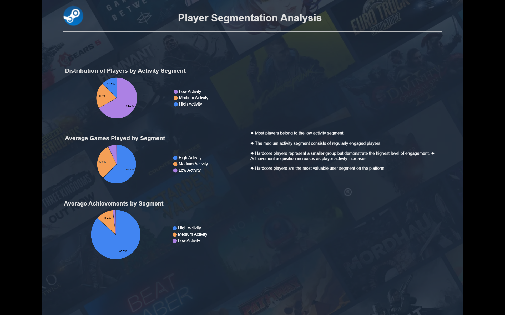
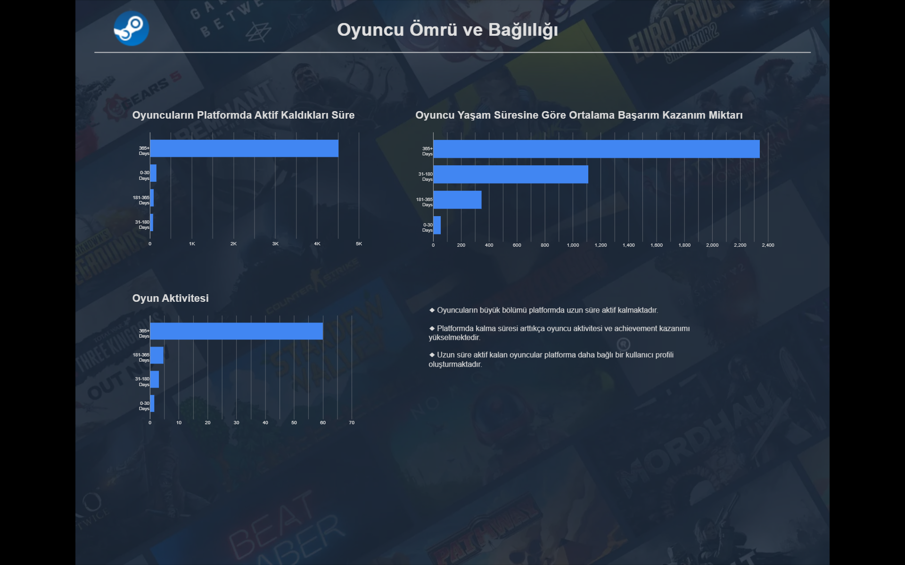
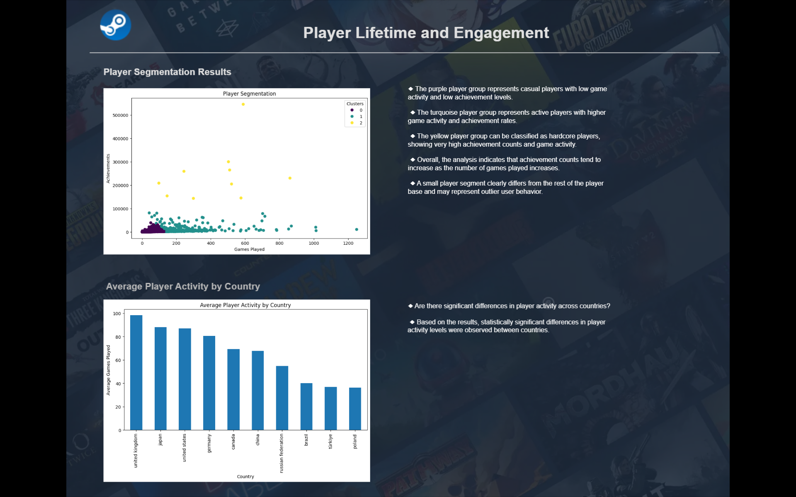
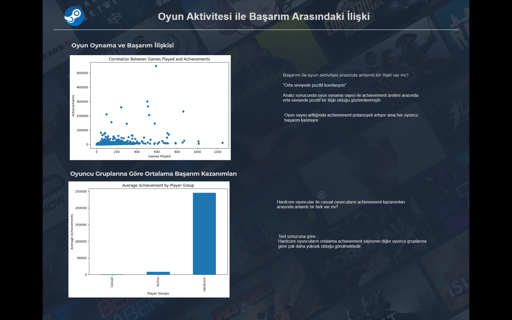

# steam-player-behavior-analysis
Team-based Data Analytics and Data Science project analyzing Steam platform data using BigQuery, dbt, Data Studio, Python, statistical analysis, and machine learning.

## Project Overview

This project was developed by a team of five and combines Data Engineering, Data Analytics, and Data Science techniques to analyze Steam platform data. The project includes data pipeline development, dashboard creation, statistical analysis, and machine learning models to explore player behavior and engagement patterns.

## Team Project Scope

This project was developed by a team of five and included the following areas::

- Steam ecosystem analysis
- Game review analysis
- Market and genre dynamics
- Purchasing power analysis
- Churn analysis
- Retention analysis
- Player behavior analysis
- Player segmentation and machine learning

## My Contributions

- Player behavior analysis
- Player segmentation using K-Means clustering
- Correlation analysis
- ANOVA test
- T-Test
- Machine learning analysis and interpretation
- Dashboard visualizations

## Technologies Used

- Fivetran
- BigQuery
- dbt
- Data Studio
- Python
- Pandas
- Scikit-learn
- Statistical Analysis
  

 ## Methods Used

### Statistical Analysis
- Correlation Analysis
- ANOVA Test
- Independent T-Test

### Machine Learning
- Elbow Method
- K-Means Clustering

### Data Visualization
- Data Studio Dashboards
- Player Segmentation Visualizations
  

## Key Findings

- A moderate positive correlation was found between games played and achievements earned.
- Significant differences in player activity were observed across countries based on ANOVA analysis.
- Statistical testing showed that hardcore players earn significantly more achievements than casual players.
- K-Means clustering revealed distinct casual, active, and hardcore player segments.
- Longer player lifetime was associated with higher activity and achievement levels.

## Dashboard Visualizations

### Player Behavior Analysis

### Player Segmentation Analysis

### Player Lifetime & Engagement

### Player Lifetime & Engagement Results

### Game Activity & Achievement Relationship

